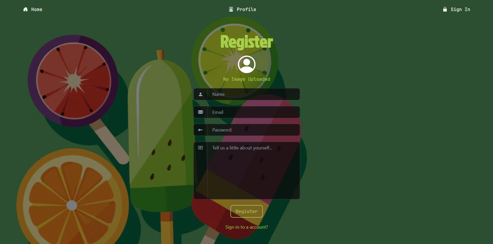
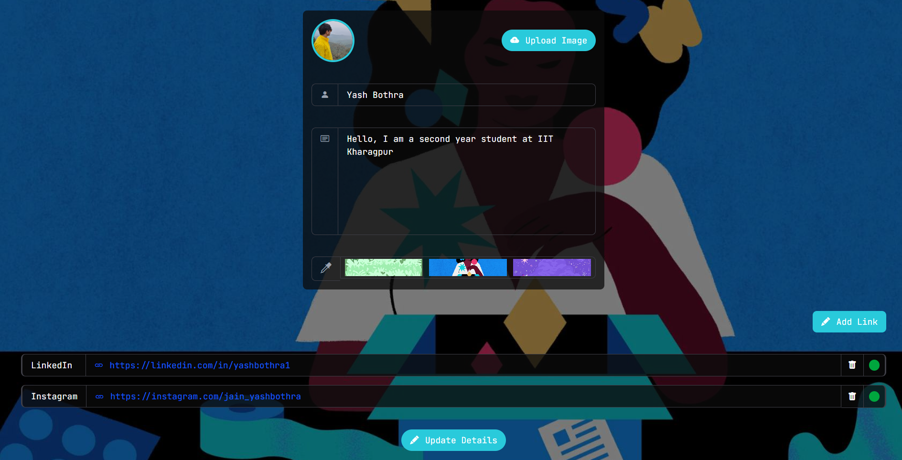

# 🚀 Linklane

Linklane is a customizable link-in-bio platform inspired by Linktree. It allows users to create a personalized profile, add social media or external links, customize themes and backgrounds, and share a single profile page with others.

---

## ✨ Features

- 🔗 Add and manage multiple social or external links
- 🎨 Customize profile appearance and themes
- 🖼️ Upload profile pictures
- 🌈 Change background designs and visual styles
- 📱 Responsive design for desktop and mobile devices
- 👤 User authentication and profile management
- 📤 Share your personalized profile with anyone
- ⚡ Fast and modern user experience

---

## 📸 Screenshots

### Registration Page



### Login Page


### Public Profile Page


### Profile Customization Dashboard



---

## 🛠️ Tech Stack

### Frontend

- React.js
- Vite
- Tailwind CSS
- HTML5
- CSS3
- JavaScript

### Backend

- Node.js
- Express.js
- MongoDB

### Development Tools

- VS Code
- Git
- GitHub
- Canva


---

## ⚙️ Installation

### Clone the Repository

```bash
git clone https://github.com/bothrayash276/Linklane.git
cd Linklane
```

### Frontend Setup

```bash
cd frontend
npm install
npm run dev
```

### Backend Setup

```bash
cd backend
npm install
npm run start
```

---

## 🔐 Environment Variables

Create a `.env` file inside the backend directory:

```env
MONGODB_URI=your_mongodb_connection_string
PORT=5000
JWT_SECRET=your_secret_key
```

> Never commit your `.env` file to GitHub.

---

## 🎯 How It Works

1. Create an account.
2. Customize your profile.
3. Add social media and external links.
4. Upload a profile picture and select a theme.
5. Share your profile URL with others.
6. Visitors can access all your important links from one page.

---

## 📁 Repositories

### Frontend

https://github.com/bothrayash276/Linklane

### Backend

https://github.com/bothrayash276/Linklane-Backend

---

## 👨‍💻 Author

**Yash Bothra**

GitHub: https://github.com/bothrayash276
